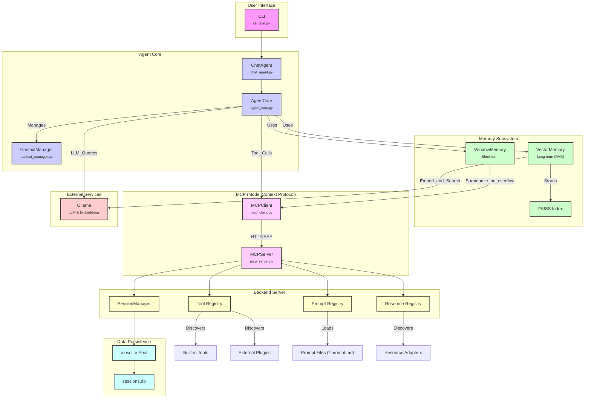

# 🤖 APE (Agentic Protocol Executor)

**A conversational AI system built on the Model Context Protocol (MCP) with persistent conversation management and intelligent tool integration.**

APE provides a sophisticated chat interface that leverages the [Model Context Protocol](https://github.com/modelcontextprotocol/python-sdk) to create an intelligent agent with database-backed session management, comprehensive conversation tools, and extensible functionality.

## ✨ Features

- 🔗 **MCP Protocol Compliance**: Built with the official [MCP Python SDK](https://github.com/modelcontextprotocol/python-sdk)
- 💾 **Persistent Sessions**: Asynchronous SQLite (aiosqlite) storage with **connection pooling**
- 🛠️ **12 Tools**: Database queries, resource access, conversation search, history management, error inspection, text summarization and more (auto-discovered)
- 🧠 **Hybrid Window Memory**: Intelligent context management with on-overflow summarisation to stay within token limits.
- 🧠 **Long-Term Vector Memory**: Utilizes a FAISS vector database, allowing the agent to embed and retrieve information semantically across sessions via the `memory_append` and `read_resource` tools.
- 🛠️ **Dynamic Resource Discovery**: A new `list_available_resources` tool allows the agent to discover available data resources at runtime, improving its autonomy and adaptability.
- 🤖 **Multi-LLM Support**: Configurable Ollama integration with various models
- 🧮 **Token & Generation Controls**: Live token budgeting plus configurable temperature / top-p / top-k
- 🔒 **HS256-Signed JWT Results**: Each tool response is wrapped in a tamper-proof JWT (`MCP_JWT_KEY`)
- 🔌 **Plugin System**: Extend functionality via `ape_mcp.tools` entry-points — zero-code changes required
- ⚙️ **pydantic-settings Configuration**: Type-safe settings that can be overridden via a simple `.env` file
- 🎯 **CLI Interface**: Rich command-line experience with real-time tool feedback
- 🔍 **Conversation Search**: Full-text search across conversation history
- 📈 **Session Analytics**: Detailed session statistics and interaction tracking
- 📚 **Resource Registry**: Browse conversations & DB schema via URIs (`conversation://`, `schema://`) exposed over MCP
- 🧩 **Extensible Plugins**: Prompts & resource adapters discoverable via entry-points (`ape_prompts.dirs`, `ape_resources.adapters`)
- ⚡ **Lazy Imports**: Heavy dependencies (Pillow, transformers, ollama) load only when actually needed
- 📚 **Import-Light API**: `import ape; agent = ape.Agent(...)` – CLI extras no longer pulled in automatically
- 🛡️ **Structured Error Bus**: `tool_errors` table + `errors://recent` resource
- 🚨 **/errors Command**: Inspect per-session tool failures straight from the CLI
- 🤝 **Agent-to-Agent (A2A) Simulation**: Includes a simulation of multi-agent collaboration (`a2a_simulation.py`). A dedicated `call_agent` tool for direct sub-task delegation is a planned future enhancement.

## 🚀 Quick Start

### Prerequisites

- **Docker** and **Docker Compose** (I use WSL2, so [Docker Desktop on Windows](https://docs.docker.com/desktop/setup/install/windows-install/#option-1-install-or-update-wsl-via-the-terminal) helped me)
- **[NVIDIA Container Toolkit](https://docs.nvidia.com/datacenter/cloud-native/container-toolkit/latest/install-guide.html)** (for GPU support, optional but recommended)

### Docker Installation (Recommended)

#### 1. Clone and Setup

```bash
# Clone the repository
git clone <your-repo-url>
cd ape

# Copy example environment file
cp env.example .env
# Edit .env as needed (JWT key is auto-generated)
```

#### 2. Start Backend Services

```bash
# Start Ollama and MCP server (background services)
docker compose up --build -d

# Wait for services to be healthy (~30-60 seconds). Check logs for any errors in a new terminal.
docker compose logs -f ollama mcp-server sandbox-mcp
```

#### 3. Download Models

```bash
# Pull required models after Ollama is healthy
docker compose exec ollama ollama pull qwen3:4b
docker compose exec ollama ollama pull qwen3:0.6b
docker compose exec ollama ollama pull nomic-embed-text
```

#### 4. Start Interactive Agent

```bash
# Start the APE agent (interactive terminal session)
docker compose run --rm --service-ports agent
```

This will attach to your terminal for interactive chat with APE.

#### Docker Configuration Details

**Services:**
- **`ollama`**: LLM server with GPU support (NVIDIA GPUs)
- **`mcp-server`**: APE's MCP protocol server (background)
- **`agent`**: Interactive CLI chat interface (profile: `interactive`)

**Persistent Volumes:**
- **`ape_db`** → `/app/database/`: Contains `sessions.db` (conversation history, summaries, tool errors)
- **`ape_data`** → `/app/data/`: Contains vector memory FAISS index and HuggingFace cache
- **`ollama_data`** → `/root/.ollama/`: Ollama models and configuration

**Security:**
- JWT keys are auto-generated on first run via `docker-entrypoint.sh`
- Services run as non-root user `apeuser` for security

**GPU Configuration:**
The Ollama service is configured for NVIDIA GPU support. Edit `docker-compose.yml` to:
- Remove GPU sections if running CPU-only
- Adjust GPU memory fraction (`OLLAMA_GPU_MEMORY_FRACTION`)
- Modify visible devices (`NVIDIA_VISIBLE_DEVICES`)

#### Managing Services

```bash
# Stop all services
docker compose down

# View logs
docker compose logs ollama
docker compose logs mcp-server

# Rebuild after code changes
docker compose build mcp-server agent

# Clean restart
docker compose down && docker compose up -d ollama mcp-server
```

### Local Installation (Alternative)

For development or if you prefer local installation:

#### Prerequisites
- **Python 3.11+**
- **Ollama** (installed locally)

#### Setup
```bash
# Create environment
conda create -n ape python=3.11
conda activate ape

# Install APE
pip install -e ".[dev,llm,images,cli]"

# Start Ollama and pull models
ollama serve
ollama pull qwen3:4b qwen3:0.6b embeddinggemma:latest

# Configure and start APE
export MCP_JWT_KEY=$(openssl rand -hex 32)
python mcp_server.py &  # Start server
python cli_chat.py     # Start interactive agent
```

#### Available CLI Commands

Once in the chat interface:

- `/help` - Show available commands
- `/history` - Display conversation history  
- `/session` - Show current session information
- `/tools` - List available MCP tools
- `/context` - Display current session context
- `/errors`  - Show recent **per-session** tool errors
- `/memory` - Show WindowMemory summary & stats
- `/clear` - Clear screen
- `/reset` - Reset session context
- `/quit` - Exit the application

## 🏗️ Project Structure

```
ape/
├── ape/                          # Core package
│   ├── settings.py               # Configuration settings
│   ├── db_pool.py                # aiosqlite connection pool
│   ├── core/
│   │   ├── agent_core.py         # Core agent logic
│   │   ├── memory.py             # WindowMemory implementation
│   │   └── vector_memory.py      # VectorMemory implementation
│   ├── mcp/                      # MCP implementation
│   │   ├── server.py             # MCP server with tool definitions
│   │   ├── implementations.py    # Tool implementation functions
│   │   └── session_manager.py    # Async Session management
│   ├── cli/
│   │   └── chat_agent.py         # CLI-specific agent logic
│   └── prompts/
│       └── templates/            # Jinja2 prompt templates
├── cli_chat.py                   # Main CLI interface (primary entry point)
├── tests/                        # Test suite
├── pyproject.toml                # Project definition and dependencies
├── docs/                         # Markdown documentation & guides
├── database/                     # SQLite and FAISS databases
└── logs/                         # Application logs
```

## 🛠️ MCP Tools & Capabilities

APE implements the full MCP protocol with **Tools**, **Resources**, and **Prompts**:

### 🔧 Available Tools (12)

| Tool | Description |
|------|-------------|
| `execute_database_query` | Execute read-only SQL SELECT queries on the conversation DB. |
| `get_conversation_history` | Retrieve conversation history by session. |
| `get_database_info` | Get database schema and table statistics. |
| `search_conversations` | Full-text search across all conversations. |
| `list_available_tools` | List all discoverable MCP tools. |
| `list_available_resources`| List all available resources that can be read with the `read_resource` tool. |
| `get_last_N_user_interactions` | Get the last N messages from the user. |
| `get_last_N_tool_interactions` | Get the last N tool call results. |
| `get_last_N_agent_interactions` | Get the last N responses from the AI. |
| `memory_append` | Appends a text snippet to the agent's long-term vector memory. |
| `read_resource` | Read any registry resource by URI, passing any parameters as named arguments. |
| `summarize_text` | Return a concise summary of the provided text. |

### 🧠 Vector Memory Usage

The agent can build a long-term memory by storing information in a vector database. This allows for semantic search over all stored memories.

- **Adding to Memory:** Use the `memory_append` tool to add text to the vector memory. For example:
  `memory_append(text="The user's favorite color is blue.")`
- **Retrieving from Memory:** The agent can automatically retrieve relevant information from the vector memory when answering questions. You can also manually query the memory using the `read_resource` tool with the `memory://` URI scheme.

## ⚙️ Configuration

### Configuration File (`ape/settings.py`)

APE relies on `pydantic-settings`; every field below can be overridden with environment variables or a `.env` file at the repository root.

```python
# Defaults
PORT = 8000                      # MCP server port
LOG_LEVEL = "DEBUG"
MCP_SERVER_URL = "http://localhost:8000"
OLLAMA_BASE_URL = "http://localhost:11434"
LLM_MODEL = "qwen3:8b"           # Default model pulled via Ollama
SLM_MODEL = "qwen3:0.6b"
EMBEDDING_MODEL = "embeddinggemma:latest"
EMBEDDING_SIZE = None
TEMPERATURE = 0.5
MAX_TOOLS_ITERATIONS = 15
TOP_P = 0.9
TOP_K = 40
MCP_JWT_KEY = ""      # MUST be set via env or .env
SESSION_DB_PATH = "database/sessions.db"
VECTOR_DB_PATH = "database/vector_memory"
VECTOR_SEARCH_TOP_K = 5
VECTOR_SEARCH_RERANK = False
UI_THEME = "dark"
SHOW_THOUGHTS = True
SUMMARIZE_THOUGHTS = False
SUMMARY_MAX_TOKENS = 128
CONTEXT_MARGIN_TOKENS = 1024     # Safety buffer for memory pruning
```

### Example `.env` Overrides

```bash
# .env
LLM_MODEL=qwen3:14b
TEMPERATURE=0.3
MAX_TOOLS_ITERATIONS=20
MCP_JWT_KEY=your-super-secret-key-here
```

## 🧪 Testing

Run the full test suite or focus on a subset:

```bash
# Run all tests
pytest tests/

# Specific modules
pytest tests/unit/test_mcp_server.py
pytest tests/unit/test_chat_functionality.py
```

## 🔧 Development

### Adding New Tools

New tools can be added by applying the `@tool` decorator from `ape.mcp.plugin` to an asynchronous function and making it discoverable via the `ape_mcp.tools` entry-point in `pyproject.toml`.

```python
# my_package/my_tools.py
from ape.mcp.plugin import tool

@tool(
    "my_new_tool",
    "A brief description of what my new tool does.",
    {
        "type": "object",
        "properties": {
            "param1": {"type": "string", "description": "First parameter"},
        },
        "required": ["param1"]
    }
)
async def my_new_tool_impl(param1: str) -> str:
    return f"Tool executed with {param1}"
```

## 🗄️ Database Schema

The system uses three tables in its SQLite database (`sessions.db`):

**1. `history`**: Stores all messages for every session.
```sql
CREATE TABLE history (
    id INTEGER PRIMARY KEY AUTOINCREMENT,
    session_id TEXT NOT NULL,
    role TEXT NOT NULL,           -- 'user', 'assistant', 'system', or 'tool'
    content TEXT NOT NULL,
    images TEXT,                  -- JSON serialized image data
    timestamp DATETIME DEFAULT CURRENT_TIMESTAMP
);
```

**2. `tool_errors`**: A structured log of every tool execution failure.
```sql
CREATE TABLE tool_errors (
    id INTEGER PRIMARY KEY AUTOINCREMENT,
    session_id TEXT,
    tool TEXT NOT NULL,
    arguments TEXT,               -- JSON serialized arguments
    error TEXT NOT NULL,
    timestamp DATETIME DEFAULT CURRENT_TIMESTAMP
);
```

**3. `summaries`**: Records summarization events from the windowed memory.
```sql
CREATE TABLE summaries (
    id INTEGER PRIMARY KEY AUTOINCREMENT,
    session_id TEXT NOT NULL,
    original_messages TEXT NOT NULL, -- JSON serialized list of messages
    summary_text TEXT NOT NULL,
    timestamp DATETIME DEFAULT CURRENT_TIMESTAMP
);
```

## Architecture Overview



### Current Status

* **Configuration**: Migrated to `pydantic-settings` (`ape/settings.py`). `.env` overrides supported.
* **CLI**: Split into thin shell, `MCPClient`, `ChatAgent`, `ContextManager`.
* **Tools**: Data-driven plugin system with `@tool` decorator and entry-point discovery (`ape.mcp.plugin`). Key tools like `summarize_text`, `memory_append`, and `read_resource` are available.
* **Integrity**: MCP server wraps every tool result in a **JWT-signed** envelope; `ChatAgent` verifies.
* **Memory Management**: Agent uses a `WindowMemory` implementation with on-overflow summarization for short-term context, and `VectorMemory` (FAISS-backed) for long-term semantic retrieval.
* **Prompt registry**: Implemented – prompt templates (`*.prompt.md`) are loaded via Jinja2 and exposed through MCP.
* **Resource registry**: Implemented – access conversation & DB schema data via `conversation://*` and `schema://*` URIs, and structured error logs via `errors://recent`.
* **Persistence**: Migrated to asynchronous `aiosqlite` for non-blocking DB operations.

> For detailed roadmap and open tasks see `docs/ROADMAP.md` (TBD).
